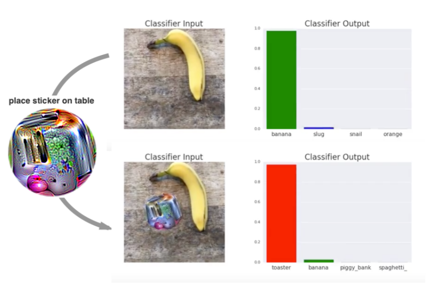

# A Paper List for Localized Adversarial Patch Research
## What is the localized adversarial patch attack?

Different from classic adversarial examples that are configured to has a small L_p norm distance to the normal examples, a localized adversarial patch attacker can <u>arbitrarily modify</u> the pixel values <u>within a small region</u>.

The attack algorithm is similar to those for the classic L_p adversarial example attack. You define a loss function and then optimize your perturbation to attain attack objective. The only difference is that now 1) you can only optimize over pixels within a small region, 2) but within that region, the pixel values are be arbitrary as long as they are valid pixels.

Example of localized adversarial patch attack (image from [Brown et al.](https://arxiv.org/abs/1712.09665)):

## What makes this attack interesting?

<u>It can be realized in the physical world!</u>

Since all perturbations are within a small region, we can print and attach the patch in our physical world. This type of attack impose a real-world threat on ML systems!

Note:  not all existing physically-realizable attacks are in the category of patch attacks, but the localized patch attack is (one of) the simplest and the most popular physical attacks.

## About this paper list

### Focus

1. <u>Test-time</u> attacks/defenses (not consider localized backdoor triggers)
2. <u>2D computer vision tasks</u> (e.g., image classification, object detection, image segmentation)
3. <u>Localized</u> attacks (not consider other physical attacks that are more "global", e.g., some stop sign attacks which require changing the entire stop sign background)
4. <u>More on defenses</u>: I try to provide a comprehensive list of defense papers while the attack papers might be incomprehensive

### Terminology

1. <u>Empirical defense</u>: defenses that are heuristic-based and have little security guarantee against an adaptive attacker
2. <u>Provably robust defenses / certifiably robust defenses / certified defenses</u>: we can prove the robustness for certain *certified* images. The robustness guarantee holds for any adaptive white-box attacker within the threat model

I am still developing this paper list (I haven't added notes for all papers). If you want to contribute to the paper list, add your paper, correct any of my comments, or share any of your suggestions, feel free to reach out :)

### Changelog

- <u>10/19/2021:</u> added recent papers, as well as some old papers that I missed in the initial release.
- <u>08/23/2021:</u> released the paper list!

## Table of Contents
- [**Image Classification**](#image-classification)
  - [Attacks](#attacks)
  - [Defenses](#defenses)
- [**Object Detection (and Semantic Segmentation)**](#object-detection-and-semantic-segmentation)
  - [Attacks](#attacks-1)
  - [Defenses](#defenses-1)

## Image Classification

### Attacks 

#### [Adversarial Patch](https://arxiv.org/abs/1712.09665)

arXiv 1712; NeurIPS workshop 2017

1. **The first paper** that introduces the concept of adversarial patch attacks
2. Demonstrate a universal physical world attack

#### [LaVAN: Localized and Visible Adversarial Noise](https://arxiv.org/abs/1801.02608)

arXiv 1801; ICML 2018

1. Seems to be a concurrent work (?) as "Adversarial Patch"
2. Digital domain attack

#### [Perceptual-Sensitive GAN for Generating Adversarial Patches](https://ojs.aaai.org//index.php/AAAI/article/view/3893)

AAAI 2019

1. generate imperceptible patches.

#### [PatchAttack: A Black-box Texture-based Attack with Reinforcement Learning](https://arxiv.org/abs/2004.05682)

arXiv 2004; ECCV 2020

1. a *black-box* attack via reinforcement learning

#### [Robust Physical-World Attacks on Face Recognition](https://arxiv.org/pdf/2011.13526.pdf)

arXiv 2011

#### [A Data Independent Approach to Generate Adversarial Patches](https://link.springer.com/article/10.1007/s00138-021-01194-6)

Sprinter 2021

1. data independent attack; attack via increasing the magnitude of feature values

#### [Enhancing Real-World Adversarial Patches with 3D Modeling Techniques](https://arxiv.org/abs/2102.05334)

arXiv 2102

1. use 3D modeling to enhance physical-world patch attack

#### [Meaningful Adversarial Stickers for Face Recognition in Physical World](https://arxiv.org/abs/2104.06728)

arXiv 2104

1. add stickers to face to fool face recognition system

#### [Improving Transferability of Adversarial Patches on Face Recognition with Generative Models](https://arxiv.org/abs/2106.15058)

arXiv 2106; CVPR 2021

1. focus on transferability 

#### [Inconspicuous Adversarial Patches for Fooling Image Recognition Systems on Mobile Devices](https://arxiv.org/abs/2106.15202)

arXiv 2106; an old version is available at [arXiv 2009](https://arxiv.org/abs/2009.09774) 

1. generate *small (inconspicuous)* and localized perturbations

#### [Patch Attack Invariance: How Sensitive are Patch Attacks to 3D Pose?](https://arxiv.org/abs/2108.07229)

arXiv 2108

1. consider physical-world patch attack in the 3-D space (images are taken from different angles)

#### [Robust Adversarial Attack Against Explainable Deep Classification Models Based on Adversarial Images With Different Patch Sizes and Perturbation Ratios](https://ieeexplore.ieee.org/document/9548896)

IEEE Access

1. use patch to attack classification models and explanation models

#### [Adversarial Token Attacks on Vision Transformers](https://arxiv.org/abs/2110.04337)

arXiv 2110

1. A analysis of perturbing part of tokens of ViT

https://arxiv.org/pdf/2106.09222.pdf

[(go back to table of contents)](#table-of-contents)

### Defenses

#### [On Visible Adversarial Perturbations & Digital Watermarking](https://openaccess.thecvf.com/content_cvpr_2018_workshops/papers/w32/Hayes_On_Visible_Adversarial_CVPR_2018_paper.pdf)

CVPR workshop 2018

1. The **first empirical defense**. Use saliency map to detect and mask adversarial patches.

#### [Local Gradients Smoothing: Defense against Localized Adversarial Attacks](https://arxiv.org/abs/1807.01216)

arXiv 1807; WACV 2019

1. An **empirical defense**. Use pixel gradient to detect patch and smooth in the suspected regions.

#### [Ally patches for spoliation of adversarial patches](https://journalofbigdata.springeropen.com/articles/10.1186/s40537-019-0213-4)

Journal of Big Data

1. An **empirical defense**, make prediction on pixel patches, and do majority voting
2. This paper is somehow missed by almost all relevant papers in this field (probably due to its venue); it only has one self-citation. However, its idea is quite similar to some certified defenses that are published in 2019-2020

#### [Defending Against Physically Realizable Attacks on Image Classification](https://arxiv.org/abs/1909.09552)

arXiv 1909, ICLR 2020

1. **Empirical defense** via adversarial training
2. Interestingly show that adversarial training for patch attack does not hurt model clean accuracy 
3. Only works on small images

#### [Certified Defenses for Adversarial Patches](https://arxiv.org/abs/2003.06693)

ICLR 2020

**The first certified defense**. 

1. Show that previous two empirical defenses (DW and LGS) are broken against an adaptive attacker
2. Adapt IBP (Interval Bound Propagation) for certified defense
3. Evaluate robustness against different shapes
4. Very expensive; only works for CIFAR-10

#### [Clipped BagNet: Defending Against Sticker Attacks with Clipped Bag-of-features](https://ieeexplore.ieee.org/document/9283860)

IEEE S&P Workshop on Deep Learning Security 2020

1. **Certified defense**; clip BagNet features
2. Efficient

#### [SentiNet: Detecting Localized Universal Attacks Against Deep Learning Systems](https://arxiv.org/abs/1812.00292)

arXiv 1812; IEEE S&P Workshop on Deep Learning Security 2020

1. **Empirical defense** that leverages the *universality* of the attack (inapplicable to non-universal attacks)

#### [(De)Randomized Smoothing for Certifiable Defense against Patch Attacks](https://arxiv.org/abs/2002.10733)

arXiv 2002, NeurIPS 2020

1. **Certified defense**; adapt ideas of randomized smoothing for $L_0$ adversary
2. Majority voting on predictions made from cropped pixel patches
3. Scale to ImageNet but expansive

#### [Detecting Patch Adversarial Attacks with Image Residuals](https://arxiv.org/abs/2002.12504)

arXiv 2002

1. **empirical defense**

#### [Minority Reports Defense: Defending Against Adversarial Patches](https://arxiv.org/abs/2004.13799)

arXiv 2004; ACNS workshop 2020

1. **Certified defense** for *detecting an attack*
2. Apply masks to the different locations of the input image and check inconsistency in masked predictions
3. Too expansive to scale to ImageNet (?)

#### [PatchGuard: A Provably Robust Defense against Adversarial Patches via Small Receptive Fields and Masking](https://arxiv.org/abs/2005.10884)

arXiv 2005; USENIX Security 2021

1. **Certified defense** framework with two general principles: small receptive field to bound the number of corrupted features and secure aggregation for final robust prediction
2. BagNet for small receptive fields; robust masking for secure aggregation, which detects and masks malicious feature values
3. Efficient; SOTA performance (in terms of both clean accuracy and provable robust accuracy)
4. Subsumes several existing and follow-up papers
5. Not parameter-free

#### [Adversarial Training against Location-Optimized Adversarial Patches](https://arxiv.org/abs/2005.02313)

arXiv 2005, ECCV workshop 2020

1. **empirical defense** via adversarial training (in which the patch location is being optimized)

#### [Vax-a-Net: Training-time Defence Against Adversarial Patch Attacks](https://arxiv.org/abs/2009.08194)

arXiv 2009; ACCV 2020

1. 

#### [Efficient Certified Defenses Against Patch Attacks on Image Classifiers](https://arxiv.org/abs/2102.04154)

Available on ICLR open review in 10/2020; ICLR 2021

1. **Certified defense**
2. BagNet to bound the number of corrupted features; Heaviside step function & majority voting for secure aggregation
3. SOTA performance on CIFAR-10
4. Efficient, evaluate on different patch shapes

#### [Certified Robustness against Physically-realizable Patch Attack via Randomized Cropping](https://openreview.net/forum?id=vttv9ADGuWF)

Available on ICLR open review in 10/2020

1. **Certified defense**
2. Randomized image cropping + majority voting
3. only probabilistic certified robustness

#### [Robustness Out of the Box: Compositional Representations Naturally Defend Against Black-Box Patch Attacks](https://arxiv.org/abs/2012.00558)

arXiv 2012

1. empirical defense; directly use CompNet to defend against *black-box* patch attack (evaluated with PatchAttack)

#### [Compositional Generative Networks and Robustness to Perceptible Image Changes](https://ieeexplore.ieee.org/abstract/document/9400221)

CISS 2021

1. An **empirical defense** against *black-box* patch attacks
2. A direct application of CompNet

#### [PatchGuard++: Efficient Provable Attack Detection against Adversarial Patches](https://arxiv.org/abs/2104.12609)

arXiv 2104; ICLR workshop 2021

1. **Certified defense** for *detecting an attack*
2. A hybrid of PatchGuard and Minority Report
3. SOTA provable robust accuracy (for attack detection) and clean accuracy on ImageNet

#### [A Novel Lightweight Defense Method Against Adversarial Patches-Based Attacks on Automated Vehicle Make and Model Recognition Systems](https://link.springer.com/article/10.1007/s10922-021-09608-6)

Journal of Network and Systems Management

1. **empirical defense.** require the assumption of horizontal symmetry of the image. only applicable to a certain scenario.

#### [Real-time Detection of Practical Universal Adversarial Perturbations](https://arxiv.org/pdf/2105.07334.pdf)

arXiv 2105

1. An **empirical defense** that use the magnitude and variance of the feature map values to detect an attack 
2. focus more on the universal attack (both localized patch and global perturbations)

#### [Turning Your Strength against You: Detecting and Mitigating Robust and Universal Adversarial Patch Attack](https://arxiv.org/abs/2108.05075)

arXiv 2108

1. empirical defense; use universality 

#### [PatchCleanser: Certifiably Robust Defense against Adversarial Patches for Any Image Classifier](https://arxiv.org/abs/2108.09135)

arXiv 2108

1. **Certified defense** that is compatible with any state-of-the-art image classifier
2. huge improvements in clean accuracy and certified robust accuracy (its clean accuracy is close to SOTA image classifier)

#### [Defending Against Universal Adversarial Patches by Clipping Feature Norms](https://openaccess.thecvf.com/content/ICCV2021/papers/Yu_Defending_Against_Universal_Adversarial_Patches_by_Clipping_Feature_Norms_ICCV_2021_paper.pdf)

ICCV 2021

1. **empirical defense** via clipping feature norm.
2. Oddly, this paper does not cite Clipped BagNet

#### [Certified Patch Robustness via Smoothed Vision Transformers](https://arxiv.org/abs/2110.07719)

arXiv 2110

1. **Certified defense.** ViT + [De-randomized Smoothing](https://arxiv.org/abs/2002.10733)
2. Drop tokens that correspond to pixel masks to greatly improve efficiency. 

[(go back to table of contents)](#table-of-contents)

### Certified Defense Leaderboard

TODO

(see two concurrent works of [PatchCleanser](https://arxiv.org/abs/2108.09135) and [smoothed ViT](https://arxiv.org/abs/2110.07719) for state-of-the-art defense performance)

## Object Detection (and Semantic Segmentation)

### Attacks

#### [DPATCH: An Adversarial Patch Attack on Object Detectors](https://arxiv.org/abs/1806.02299)

arXiv 1806; AAAI workshop 2019

1. The **first (?) patch attack against object detector**

#### [Fooling automated surveillance cameras: adversarial patches to attack person detection](https://arxiv.org/abs/1904.08653)

arXiv 1904; CVPR workshop 2019

1. using a rigid board printed with adversarial perturbations to evade detection of person

#### [On Physical Adversarial Patches for Object Detection](https://arxiv.org/abs/1906.11897)

arXiv 1906

1. interestingly show that a physical-world patch at the background (far away from the victim objects) can have malicious effect

#### [Universal Physical Camouflage Attacks on Object Detectors](https://arxiv.org/pdf/1909.04326.pdf)

arXiv 1909

#### [Seeing isn't Believing: Towards More Robust Adversarial Attack Against Real World Object Detectors](https://dl.acm.org/doi/10.1145/3319535.3354259)

CCS 2019

#### [Adversarial T-shirt! Evading Person Detectors in A Physical World](https://arxiv.org/abs/1910.11099)

arXiv 1910; ECCV 2020

1. use a non-rigid T-shirt to evade person detection

#### [Making an Invisibility Cloak: Real World Adversarial Attacks on Object Detectors](https://arxiv.org/abs/1910.14667)

arXiv 1910; ECCV 2020

1. wear an ugly T-shirt to evade person detection

#### [APRICOT: A Dataset of Physical Adversarial Attacks on Object Detection](https://arxiv.org/abs/1912.08166)

arXiv 1912

#### [Adaptive Square Attack: Fooling Autonomous Cars With Adversarial Traffic Signs](https://ieeexplore.ieee.org/document/9165820)

IEEE IoT-J 2020

#### [Adversarial Patch Camouflage against Aerial Detection](https://arxiv.org/abs/2008.13671)

arXiv 2008

#### [Fast Local Attack: Generating Local Adversarial Examples for Object Detectors](https://arxiv.org/abs/2010.14291)

arXiv 2010; IJCNN 2020

#### [DPAttack: Diffused Patch Attacks against Universal Object Detection](https://arxiv.org/abs/2010.11679)

arXiv 2010; CIKM workshop

#### [Object Hider: Adversarial Patch Attack Against Object Detectors](https://arxiv.org/abs/2010.14974)

arXiv 2010

#### [Dynamic Adversarial Patch for Evading Object Detection Models](https://arxiv.org/abs/2010.13070)

arXiv 2010

#### [RPATTACK: Refined Patch Attack on General Object Detectors](https://arxiv.org/abs/2103.12469)

arXiv 2103; ICME 2021

#### [IPatch: A Remote Adversarial Patch](https://arxiv.org/pdf/2105.00113.pdf)

arXiv 2105

#### [Evaluating the Robustness of Semantic Segmentation for Autonomous Driving against Real-World Adversarial Patch Attacks](https://arxiv.org/abs/2108.06179)

arXiv 2108

#### [Physical Adversarial Attacks on an Aerial Imagery Object Detector](https://arxiv.org/abs/2108.11765)

arXiv 2108

#### [You Cannot Easily Catch Me: A Low-Detectable Adversarial Patch for Object Detectors](https://arxiv.org/abs/2109.15177)

arXiv 2109

1. attack against object detectors that can also evade attack-detection models.

#### [Naturalistic Physical Adversarial Patch for Object Detectors](https://openaccess.thecvf.com/content/ICCV2021/papers/Hu_Naturalistic_Physical_Adversarial_Patch_for_Object_Detectors_ICCV_2021_paper.pdf)

ICCV 2021

1. an improved attack from adversarial T-shirt. The patch looks more natural (e.g., a dog)

[(go back to table of contents)](#table-of-contents)

### Defenses

#### [Role of Spatial Context in Adversarial Robustness for Object Detection](https://arxiv.org/abs/1910.00068)

arXiv 1910; CVPR workshop 2020

1. The **first empirical defense**, adding a regularization loss to constrain the use of spatial information
2. only experiment on YOLOv2 and small datasets like PASCAL VOC

#### [Meta Adversarial Training against Universal Patches](https://arxiv.org/pdf/2101.11453.pdf)

arXiv 210; ICML 2021 workshop

#### [DetectorGuard: Provably Securing Object Detectors against Localized Patch Hiding Attacks](https://arxiv.org/abs/2102.02956)

arXiv 2102

1. The **first certified defense** for patch hiding attack
2. Adapt robust image classifiers for robust object detection
3. Provable robustness at a negligible cost of clean performance

#### [Adversarial YOLO: Defense Human Detection Patch Attacks via Detecting Adversarial Patches](https://arxiv.org/abs/2103.08860)

arXiv 2103

1. **Empirical defense** via adding adversarial patches and a "patch" class during the training

#### [We Can Always Catch You: Detecting Adversarial Patched Objects WITH or WITHOUT Signature](https://arxiv.org/abs/2106.05261)

arXiv 2106

1. Two **empirical defenses** for patch hiding attack
2. Feed small image region to the detector; grows the region with some heuristics; detect an attack when YOLO detects objects in a smaller region but miss objects in a larger expanded region.

[(go back to table of contents)](#table-of-contents)

